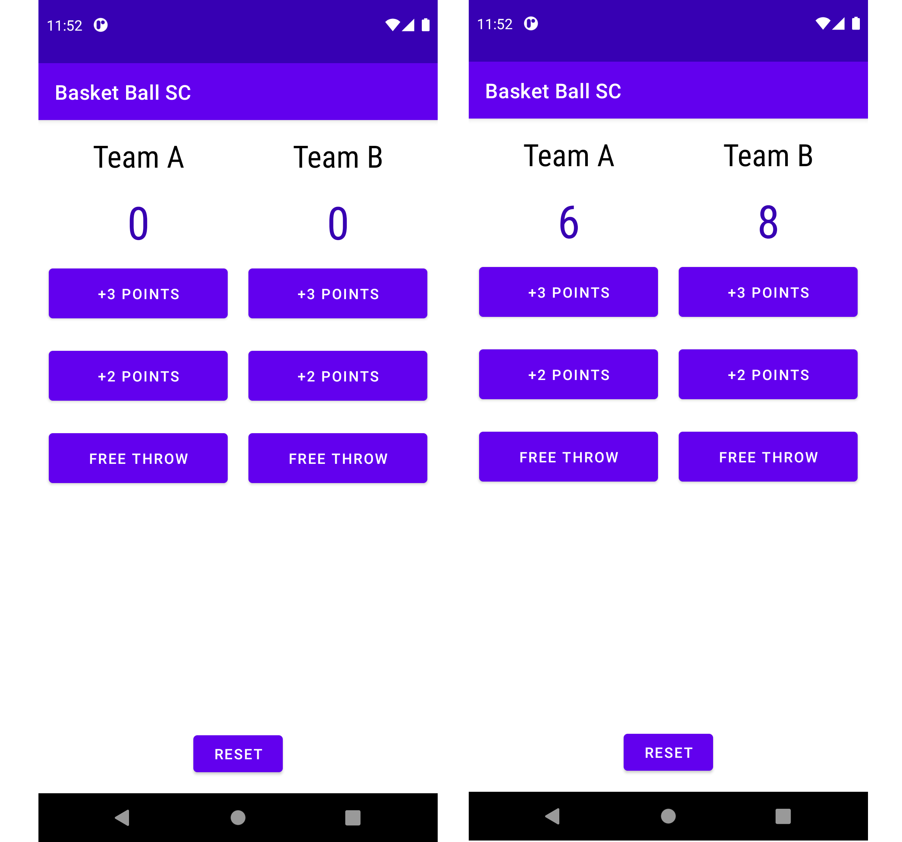

# BasketBallSC
 This is a sample app which i built just to implement some of my learnings in Android while the side motive is to become comfortable with Java Syntax.
# Learnings (How to?) 
- Work with viewgroups
- Use Linear Layout along with Relative Layout 
- Set On click Listeners
- Comfortable with Java OOPS :)

# Screenshots 

